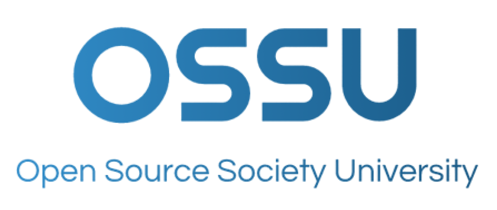

  
  
Roadmap to a free self-taught education in CS by OSSU!

  

    <a href="#prerequisites">Prerequisites</a> · 
    <a href="#intro-cs">Intro CS</a> · 
    <a href="#core-cs">Core CS</a> · 
    <a href="#advanced-cs">Advanced CS</a>
  

## Prerequisites

### [High school Math](https://github.com/wesleydmscn/computer-science-ossu/milestone/1)

| Courses                                                                                   | Units |   Prerequisites   |                                 Issue                                 |
| :---------------------------------------------------------------------------------------- | :---: | :---------------: | :-------------------------------------------------------------------: |
| [Arithmetics](https://www.khanacademy.org/math/arithmetic#arithmetic-subject-challenge)   |  19   |       none        |  [#1](https://github.com/wesleydmscn/computer-science-ossu/issues/1)  |
| [Pre-algebra](https://www.khanacademy.org/math/pre-algebra#pre-algebra-subject-challenge) |  15   |    Arithmetics    |  [#3](https://github.com/wesleydmscn/computer-science-ossu/issues/3)  |
| [Basic Algebra](https://www.khanacademy.org/math/algebra-basics/)                         |   8   |    Pre-algebra    | [#11](https://github.com/wesleydmscn/computer-science-ossu/issues/11) |
| [Basic Geometry](https://www.khanacademy.org/math/basic-geo#basic-geo-subject-challenge)  |  14   |   Basic Algebra   |  [#2](https://github.com/wesleydmscn/computer-science-ossu/issues/2)  |
| [Integrated Math 1](https://www.khanacademy.org/math/math1#math1-subject-challenge)       |  18   |  Basic Geometry   |  [#4](https://github.com/wesleydmscn/computer-science-ossu/issues/4)  |
| [Integrated Math 2](https://www.khanacademy.org/math/math2#math2-subject-challenge)       |  13   | Integrated Math 1 |  [#5](https://github.com/wesleydmscn/computer-science-ossu/issues/5)  |
| [Integrated Math 3](https://www.khanacademy.org/math/math3#math3-subject-challenge)       |  13   | Integrated Math 2 |  [#6](https://github.com/wesleydmscn/computer-science-ossu/issues/6)  |

### [Hign school Physics](https://github.com/wesleydmscn/computer-science-ossu/milestone/2)

| Courses                                                                  | Units |             Prerequisites             |                                Issue                                |
| :----------------------------------------------------------------------- | :---: | :-----------------------------------: | :-----------------------------------------------------------------: |
| [AP Physics 1](https://www.khanacademy.org/science/ap-college-physics-1) |   5   | [High school Math](#high-school-math) | [#7](https://github.com/wesleydmscn/computer-science-ossu/issues/7) |
| [AP Physics 2](https://www.khanacademy.org/science/ap-physics-2)         |   8   |             AP Physics 1              | [#8](https://github.com/wesleydmscn/computer-science-ossu/issues/8) |

## Intro CS

### [Introduction to Programming](https://github.com/wesleydmscn/computer-science-ossu/milestone/3)

**Topics covered**:
`simple programs`
`simple data structures`

| Courses                                              | Duration |    Effort     | Prerequisites |             Discussion             |
| :--------------------------------------------------- | :------: | :-----------: | :-----------: | :--------------------------------: |
| [Python for Everybody](https://www.py4e.com/lessons) | 10 weeks | 10 hours/week |     none      | [chat](https://discord.gg/syA242Z) |

### [Introduction to Computer Science](https://github.com/wesleydmscn/computer-science-ossu/milestone/3)

**Topics covered**:
`computation`
`imperative programming`
`basic data structures and algorithms`
`and more`

| Courses                                                                                                                                                                                                                                                          | Duration |    Effort     |                            Prerequisites                             |             Discussion             |
| :--------------------------------------------------------------------------------------------------------------------------------------------------------------------------------------------------------------------------------------------------------------- | :------: | :-----------: | :------------------------------------------------------------------: | :--------------------------------: |
| [Introduction to Computer Science and Programming using Python](https://ocw.mit.edu/courses/6-0001-introduction-to-computer-science-and-programming-in-python-fall-2016/) ([alt](https://www.edx.org/course/introduction-to-computer-science-and-programming-7)) | 9 weeks  | 15 hours/week | [high school algebra](https://www.khanacademy.org/math/algebra-home) | [chat](https://discord.gg/jvchSm9) |

## Core CS

All coursework under Core CS is **required**, unless otherwise indicated.

### Core programming
**Topics covered**:
`functional programming`
`design for testing`
`program requirements`
`common design patterns`
`unit testing`
`object-oriented design`
`static typing`
`dynamic typing`
`ML-family languages (via Standard ML)`
`Lisp-family languages (via Racket)`
`Ruby`
`and more`

| Courses                                                                                                                                 | Duration |     Effort      |                                                    Prerequisites                                                     |             Discussion             |
| :-------------------------------------------------------------------------------------------------------------------------------------- | :------: | :-------------: | :------------------------------------------------------------------------------------------------------------------: | :--------------------------------: |
| [How to Code - Simple Data](https://www.edx.org/course/how-to-code-simple-data) [(textbook)](https://htdp.org/2022-8-7/Book/index.html) | 7 weeks  | 8-10 hours/week |                                                         none                                                         | [chat](https://discord.gg/RfqAmGJ) |
| [How to Code - Complex Data](https://www.edx.org/course/how-to-code-complex-data)                                                       | 6 weeks  | 8-10 hours/week |                                               How to Code: Simple Data                                               | [chat](https://discord.gg/kczJzpm) |
| [Programming Languages, Part A](https://www.coursera.org/learn/programming-languages)                                                   | 5 weeks  | 4-8 hours/week  | How to Code ([Hear instructor](https://www.coursera.org/lecture/programming-languages/recommended-background-k1yuh)) | [chat](https://discord.gg/8BkJtXN) |
| [Programming Languages, Part B](https://www.coursera.org/learn/programming-languages-part-b)                                            | 3 weeks  | 4-8 hours/week  |                                            Programming Languages, Part A                                             | [chat](https://discord.gg/EeA7VR9) |
| [Programming Languages, Part C](https://www.coursera.org/learn/programming-languages-part-c)                                            | 3 weeks  | 4-8 hours/week  |                                            Programming Languages, Part B                                             | [chat](https://discord.gg/8EZUVbA) |
| [Object-Oriented Design](https://www.coursera.org/learn/object-oriented-design)                                                         | 4 weeks  |  4 hours/week   |                              [Basic Java](https://www.youtube.com/watch?v=GoXwIVyNvX0)                               |
| [Design Patterns](https://www.coursera.org/learn/design-patterns)                                                                       | 4 weeks  |  4 hours/week   |                                                Object-Oriented Design                                                |
| [Software Architecture](https://www.coursera.org/learn/software-architecture)                                                           | 4 weeks  | 2-5 hours/week  |                                                   Design Patterns                                                    |

### Core math
Discrete math (Math for CS) is a prerequisite and closely related to the study of algorithms and data structures. Calculus both prepares students for discrete math and helps students develop mathematical maturity.

**Topics covered**:
`discrete mathematics`
`mathematical proofs`
`basic statistics`
`O-notation`
`discrete probability`
`and more`

| Courses                                                                                                                                                                                                                | Duration |     Effort      |                                                                                                                                                       Notes                                                                                                                                                        |                           Prerequisites                            |             Discussion             |
| :--------------------------------------------------------------------------------------------------------------------------------------------------------------------------------------------------------------------- | :------: | :-------------: | :----------------------------------------------------------------------------------------------------------------------------------------------------------------------------------------------------------------------------------------------------------------------------------------------------------------: | :----------------------------------------------------------------: | :--------------------------------: |
| [Calculus 1A: Differentiation](https://openlearninglibrary.mit.edu/courses/course-v1:MITx+18.01.1x+2T2019/about) ([alt](https://ocw.mit.edu/courses/mathematics/18-01sc-single-variable-calculus-fall-2010/index.htm)) | 13 weeks | 6-10 hours/week |                                                                                                                               The alternate covers this and the following 2 courses                                                                                                                                | [high school math](FAQ.md#how-can-i-review-the-math-prerequisites) | [chat](https://discord.gg/mPCt45F) |
| [Calculus 1B: Integration](https://openlearninglibrary.mit.edu/courses/course-v1:MITx+18.01.2x+3T2019/about)                                                                                                           | 13 weeks | 5-10 hours/week |                                                                                                                                                         -                                                                                                                                                          |                            Calculus 1A                             | [chat](https://discord.gg/sddAsZg) |
| [Calculus 1C: Coordinate Systems & Infinite Series](https://openlearninglibrary.mit.edu/courses/course-v1:MITx+18.01.3x+1T2020/about)                                                                                  | 6 weeks  | 5-10 hours/week |                                                                                                                                                         -                                                                                                                                                          |                            Calculus 1B                             | [chat](https://discord.gg/FNEcNNq) |
| [Mathematics for Computer Science](https://openlearninglibrary.mit.edu/courses/course-v1:OCW+6.042J+2T2019/about) ([alt](https://ocw.mit.edu/courses/6-042j-mathematics-for-computer-science-fall-2010/))              | 13 weeks |  5 hours/week   | [2015/2019 solutions](https://github.com/spamegg1/Math-for-CS-solutions) [2010 solutions](https://github.com/frevib/mit-cs-math-6042-fall-2010-problems) [2005 solutions](https://ocw.mit.edu/courses/electrical-engineering-and-computer-science/6-042j-mathematics-for-computer-science-fall-2005/assignments/). |                            Calculus 1C                             | [chat](https://discord.gg/EuTzNbF) |

### CS Tools
Understanding theory is important, but you will also be expected to create programs. There are a number of tools that are widely used to make that process easier. Learn them now to ease your future work writing programs.

**Topics covered**:
`terminals and shell scripting`
`vim`
`command line environments`
`version control`
`and more`

| Courses                                                                     | Duration |    Effort     | Prerequisites |             Discussion             |
| :-------------------------------------------------------------------------- | :------: | :-----------: | :-----------: | :--------------------------------: |
| [The Missing Semester of Your CS Education](https://missing.csail.mit.edu/) | 2 weeks  | 12 hours/week |       -       | [chat](https://discord.gg/5FvKycS) |

### Core systems

**Topics covered**:
`procedural programming`
`manual memory management`
`boolean algebra`
`gate logic`
`memory`
`computer architecture`
`assembly`
`machine language`
`virtual machines`
`high-level languages`
`compilers`
`operating systems`
`network protocols`
`and more`

| Courses                                                                                                                                                     |  Duration   |      Effort      |                    Additional Text / Assignments                     |                                                                             Prerequisites                                                                             |             Discussion             |
| :---------------------------------------------------------------------------------------------------------------------------------------------------------- | :---------: | :--------------: | :------------------------------------------------------------------: | :-------------------------------------------------------------------------------------------------------------------------------------------------------------------: | :--------------------------------: |
| [Build a Modern Computer from First Principles: From Nand to Tetris](https://www.coursera.org/learn/build-a-computer) ([alt](https://www.nand2tetris.org/)) |   6 weeks   | 7-13 hours/week  |                                  -                                   |                                                                      C-like programming language                                                                      | [chat](https://discord.gg/vxB2DRV) |
| [Build a Modern Computer from First Principles: Nand to Tetris Part II ](https://www.coursera.org/learn/nand2tetris2)                                       |   6 weeks   | 12-18 hours/week |                                  -                                   | one of [these programming languages](https://user-images.githubusercontent.com/2046800/35426340-f6ce6358-026a-11e8-8bbb-4e95ac36b1d7.png), From Nand to Tetris Part I | [chat](https://discord.gg/AsUXcPu) |
| [Operating Systems: Three Easy Pieces](coursepages/ostep/README.md)                                                                                         | 10-12 weeks | 6-10 hours/week  |                                  -                                   |                                                                        Nand to Tetris Part II                                                                         | [chat](https://discord.gg/wZNgpep) |
| [Computer Networking: a Top-Down Approach](http://gaia.cs.umass.edu/kurose_ross/online_lectures.htm)                                                        |   8 weeks   | 4–12 hours/week  | [Wireshark Labs](http://gaia.cs.umass.edu/kurose_ross/wireshark.php) |                                                                    algebra, probability, basic CS                                                                     | [chat](https://discord.gg/MJ9YXyV) |

### Core theory

**Topics covered**:
`divide and conquer`
`sorting and searching`
`randomized algorithms`
`graph search`
`shortest paths`
`data structures`
`greedy algorithms`
`minimum spanning trees`
`dynamic programming`
`NP-completeness`
`and more`

| Courses                                                                                                                          | Duration |     Effort     |                            Prerequisites                             |             Discussion             |
| :------------------------------------------------------------------------------------------------------------------------------- | :------: | :------------: | :------------------------------------------------------------------: | :--------------------------------: |
| [Divide and Conquer, Sorting and Searching, and Randomized Algorithms](https://www.coursera.org/learn/algorithms-divide-conquer) | 4 weeks  | 4-8 hours/week |      any programming language, Mathematics for Computer Science      | [chat](https://discord.gg/mKRS7tY) |
| [Graph Search, Shortest Paths, and Data Structures](https://www.coursera.org/learn/algorithms-graphs-data-structures)            | 4 weeks  | 4-8 hours/week | Divide and Conquer, Sorting and Searching, and Randomized Algorithms | [chat](https://discord.gg/Qstqe4t) |
| [Greedy Algorithms, Minimum Spanning Trees, and Dynamic Programming](https://www.coursera.org/learn/algorithms-greedy)           | 4 weeks  | 4-8 hours/week |          Graph Search, Shortest Paths, and Data Structures           | [chat](https://discord.gg/dWVvjuz) |
| [Shortest Paths Revisited, NP-Complete Problems and What To Do About Them](https://www.coursera.org/learn/algorithms-npcomplete) | 4 weeks  | 4-8 hours/week |  Greedy Algorithms, Minimum Spanning Trees, and Dynamic Programming  | [chat](https://discord.gg/dYuY78u) |

### Core security
**Topics covered**
`Confidentiality, Integrity, Availability`
`Secure Design`
`Defensive Programming`
`Threats and Attacks`
`Network Security`
`Cryptography`
`and more`

| Courses                                                                                                     | Duration |      Effort      | Prerequisites |              Discussion               |
| :---------------------------------------------------------------------------------------------------------- | :------: | :--------------: | :-----------: | :-----------------------------------: |
| [Cybersecurity Fundamentals](https://www.edx.org/course/cybersecurity-fundamentals)                         | 8 weeks  | 10-12 hours/week |       -       | [chat](https://discord.gg/XdY3AwTFK4) |
| [Principles of Secure Coding](https://www.coursera.org/learn/secure-coding-principles)                      | 4 weeks  |   4 hours/week   |       -       |  [chat](https://discord.gg/5gMdeSK)   |
| [Identifying Security Vulnerabilities](https://www.coursera.org/learn/identifying-security-vulnerabilities) | 4 weeks  |   4 hours/week   |       -       |  [chat](https://discord.gg/V78MjUS)   |

Choose **one** of the following:

| Courses                                                                                                                                              | Duration |    Effort    | Prerequisites |             Discussion             |
| :--------------------------------------------------------------------------------------------------------------------------------------------------- | :------: | :----------: | :-----------: | :--------------------------------: |
| [Identifying Security Vulnerabilities in C/C++Programming](https://www.coursera.org/learn/identifying-security-vulnerabilities-c-programming)        | 4 weeks  | 5 hours/week |       -       | [chat](https://discord.gg/Vbxce7A) |
| [Exploiting and Securing Vulnerabilities in Java Applications](https://www.coursera.org/learn/exploiting-securing-vulnerabilities-java-applications) | 4 weeks  | 5 hours/week |       -       | [chat](https://discord.gg/QxC22rR) |

### Core applications

**Topics covered**:
`Agile methodology`
`REST`
`software specifications`
`refactoring`
`relational databases`
`transaction processing`
`data modeling`
`neural networks`
`supervised learning`
`unsupervised learning`
`OpenGL`
`ray tracing`
`and more`

| Courses                                                                                            | Duration |     Effort      |                                                              Prerequisites                                                              |             Discussion             |
| :------------------------------------------------------------------------------------------------- | :------: | :-------------: | :-------------------------------------------------------------------------------------------------------------------------------------: | :--------------------------------: |
| [Databases: Modeling and Theory](https://www.edx.org/course/modeling-and-theory)                   | 2 weeks  |  10 hours/week  |                                                            core programming                                                             | [chat](https://discord.gg/pMFqNf4) |
| [Databases: Relational Databases and SQL](https://www.edx.org/course/databases-5-sql)              | 2 weeks  |  10 hours/week  |                                                            core programming                                                             | [chat](https://discord.gg/P8SPPyF) |
| [Databases: Semistructured Data](https://www.edx.org/course/semistructured-data)                   | 2 weeks  |  10 hours/week  |                                                            core programming                                                             | [chat](https://discord.gg/duCJ3GN) |
| [Machine Learning](https://www.coursera.org/specializations/machine-learning-introduction)         | 11 weeks |  9 hours/week   |                                                              Basic coding                                                               | [chat](https://discord.gg/NcXHDjy) |
| [Computer Graphics](https://www.edx.org/course/computer-graphics-2)                                | 6 weeks  |  12 hours/week  |                                                       C++ or Java, linear algebra                                                       | [chat](https://discord.gg/68WqMNV) |
| [Software Engineering: Introduction](https://www.edx.org/course/software-engineering-introduction) | 6 weeks  | 8-10 hours/week | Core Programming, and a [sizable project](FAQ.md#why-require-experience-with-a-sizable-project-before-the-Software-Engineering-courses) | [chat](https://discord.gg/5Qtcwtz) |

### Core ethics

**Topics covered**:
`Social Context`
`Analytical Tools`
`Professional Ethics`
`Intellectual Property`
`Privacy and Civil Liberties`
`and more`

| Courses                                                                                                     | Duration |    Effort    | Prerequisites |              Discussion               |
| :---------------------------------------------------------------------------------------------------------- | :------: | :----------: | :-----------: | :-----------------------------------: |
| [Ethics, Technology and Engineering](https://www.coursera.org/learn/ethics-technology-engineering)          | 9 weeks  | 2 hours/week |     none      | [chat](https://discord.gg/6ttjPmzZbe) |
| [Introduction to  Intellectual Property](https://www.coursera.org/learn/introduction-intellectual-property) | 4 weeks  | 2 hours/week |     none      | [chat](https://discord.gg/YbuERswpAK) |
| [Data Privacy Fundamentals](https://www.coursera.org/learn/northeastern-data-privacy)                       | 3 weeks  | 3 hours/week |     none      | [chat](https://discord.gg/64J34ajNBd) |

## Advanced CS

After completing **every required course** in Core CS, students should choose a subset of courses from Advanced CS based on interest.
Not every course from a subcategory needs to be taken.
But students should take *every* course that is relevant to the field they intend to go into.

### Advanced programming

**Topics covered**:
`debugging theory and practice`
`goal-oriented programming`
`parallel computing`
`object-oriented analysis and design`
`UML`
`large-scale software architecture and design`
`and more`

| Courses                                                                                                                                                 | Duration |     Effort     |            Prerequisites            |
| :------------------------------------------------------------------------------------------------------------------------------------------------------ | :------: | :------------: | :---------------------------------: |
| [Parallel Programming](https://www.coursera.org/learn/scala-parallel-programming)                                                                       | 4 weeks  | 6-8 hours/week |          Scala programming          |
| [Compilers](https://www.edx.org/course/compilers)                                                                                                       | 9 weeks  | 6-8 hours/week |                none                 |
| [Introduction to Haskell](https://www.seas.upenn.edu/~cis194/fall16/)                                                                                   | 14 weeks |       -        |                  -                  |
| [Learn Prolog Now!](https://www.let.rug.nl/bos/lpn//lpnpage.php?pageid=online) ([alt](https://github.com/ossu/computer-science/files/6085884/lpn.pdf))* | 12 weeks |       -        |                  -                  |
| [Software Debugging](https://www.udacity.com/course/software-debugging--cs259)                                                                          | 8 weeks  |  6 hours/week  | Python, object-oriented programming |
| [Software Testing](https://www.udacity.com/course/software-testing--cs258)                                                                              | 4 weeks  |  6 hours/week  |   Python, programming experience    |

(*) book by Blackburn, Bos, Striegnitz (compiled from [source](https://github.com/LearnPrologNow/lpn), redistributed under [CC license](https://creativecommons.org/licenses/by-sa/4.0/))

### Advanced systems

**Topics covered**:
`digital signaling`
`combinational logic`
`CMOS technologies`
`sequential logic`
`finite state machines`
`processor instruction sets`
`caches`
`pipelining`
`virtualization`
`parallel processing`
`virtual memory`
`synchronization primitives`
`system call interface`
`and more`

| Courses                                                                                                                                                                                                                                                                     | Duration |    Effort    |                         Prerequisites                         |                 Notes                  |
| :-------------------------------------------------------------------------------------------------------------------------------------------------------------------------------------------------------------------------------------------------------------------------- | :------: | :----------: | :-----------------------------------------------------------: | :------------------------------------: |
| [Computation Structures 1: Digital Circuits](https://learning.edx.org/course/course-v1:MITx+6.004.1x_3+3T2016) [alt1](https://ocw.mit.edu/courses/6-004-computation-structures-spring-2017/) [alt2 ](https://ocw.mit.edu/courses/6-004-computation-structures-spring-2009/) | 10 weeks | 6 hours/week | [Nand2Tetris II](https://www.coursera.org/learn/nand2tetris2) | Alternate links contain all 3 courses. |
| [Computation Structures 2: Computer Architecture](https://learning.edx.org/course/course-v1:MITx+6.004.2x+3T2015)                                                                                                                                                           | 10 weeks | 6 hours/week |                   Computation Structures 1                    |
| [Computation Structures 3: Computer Organization](https://learning.edx.org/course/course-v1:MITx+6.004.3x_2+1T2017)                                                                                                                                                         | 10 weeks | 6 hours/week |                   Computation Structures 2                    |

### Advanced theory

**Topics covered**:
`formal languages`
`Turing machines`
`computability`
`event-driven concurrency`
`automata`
`distributed shared memory`
`consensus algorithms`
`state machine replication`
`computational geometry theory`
`propositional logic`
`relational logic`
`Herbrand logic`
`game trees`
`and more`

| Courses                                                                                                                                                  | Duration |    Effort     |                                                            Prerequisites                                                             |
| :------------------------------------------------------------------------------------------------------------------------------------------------------- | :------: | :-----------: | :----------------------------------------------------------------------------------------------------------------------------------: |
| [Theory of Computation](https://ocw.mit.edu/courses/18-404j-theory-of-computation-fall-2020/) ([alt](http://aduni.org/courses/theory/index.php?view=cw)) | 13 weeks | 10 hours/week | [Mathematics for Computer Science](https://openlearninglibrary.mit.edu/courses/course-v1:OCW+6.042J+2T2019/about), logic, algorithms |
| [Computational Geometry](https://www.edx.org/course/computational-geometry)                                                                              | 16 weeks | 8 hours/week  |                                                           algorithms, C++                                                            |
| [Game Theory](https://www.coursera.org/learn/game-theory-1)                                                                                              | 8 weeks  | 3 hours/week  |                                             mathematical thinking, probability, calculus                                             |

### Advanced Information Security

| Courses                                                                                                                                                                  | Duration |     Effort     |                        Prerequisites                         |
| :----------------------------------------------------------------------------------------------------------------------------------------------------------------------- | :------: | :------------: | :----------------------------------------------------------: |
| [Web Security Fundamentals](https://www.edx.org/course/web-security-fundamentals)                                                                                        | 5 weeks  | 4-6 hours/week |             understanding basic web technologies             |
| [Security Governance & Compliance](https://www.coursera.org/learn/security-governance-compliance)                                                                        | 3 weeks  |  3 hours/week  |                              -                               |
| [Digital Forensics Concepts](https://www.coursera.org/learn/digital-forensics-concepts)                                                                                  | 3 weeks  | 2-3 hours/week |                        Core Security                         |
| [Secure Software Development: Requirements, Design, and Reuse](https://www.edx.org/course/secure-software-development-requirements-design-and-reuse)                     | 7 weeks  | 1-2 hours/week |              Core Programming and Core Security              |
| [Secure Software Development: Implementation](https://www.edx.org/course/secure-software-development-implementation)                                                     | 7 weeks  | 1-2 hours/week | Secure Software Development: Requirements, Design, and Reuse |
| [Secure Software Development: Verification and More Specialized Topics](https://www.edx.org/course/secure-software-development-verification-and-more-specialized-topics) | 7 weeks  | 1-2 hours/week |         Secure Software Development: Implementation          |

### Advanced math
| Courses                                                                                                                                      | Duration |     Effort      |                                        Prerequisites                                        |             Discussion             |
| :------------------------------------------------------------------------------------------------------------------------------------------- | :------: | :-------------: | :-----------------------------------------------------------------------------------------: | :--------------------------------: |
| [Essence of Linear Algebra](https://www.youtube.com/playlist?list=PLZHQObOWTQDPD3MizzM2xVFitgF8hE_ab)                                        |    -     |        -        |             [high school math](FAQ.md#how-can-i-review-the-math-prerequisites)              | [chat](https://discord.gg/m6wHbP6) |
| [Linear Algebra](https://ocw.mit.edu/courses/mathematics/18-06sc-linear-algebra-fall-2011/)                                                  | 14 weeks |  12 hours/week  |                           corequisite: Essence of Linear Algebra                            | [chat](https://discord.gg/k7nSWJH) |
| [Introduction to Numerical Methods](https://ocw.mit.edu/courses/mathematics/18-335j-introduction-to-numerical-methods-spring-2019/index.htm) | 14 weeks |  12 hours/week  | [Linear Algebra](https://ocw.mit.edu/courses/mathematics/18-06sc-linear-algebra-fall-2011/) | [chat](https://discord.gg/FNEcNNq) |
| [Introduction to Formal Logic](https://forallx.openlogicproject.org/)                                                                        | 10 weeks | 4-8 hours/week  |   [Set Theory](https://www.youtube.com/playlist?list=PL5KkMZvBpo5AH_5GpxMiryJT6Dkj32H6N)    | [chat](https://discord.gg/MbM2Gg5) |
| [Probability](https://projects.iq.harvard.edu/stat110/home)                                                                                  | 15 weeks | 5-10 hours/week |    [Differentiation and Integration](https://www.edx.org/course/calculus-1b-integration)    | [chat](https://discord.gg/UVjs9BU) |